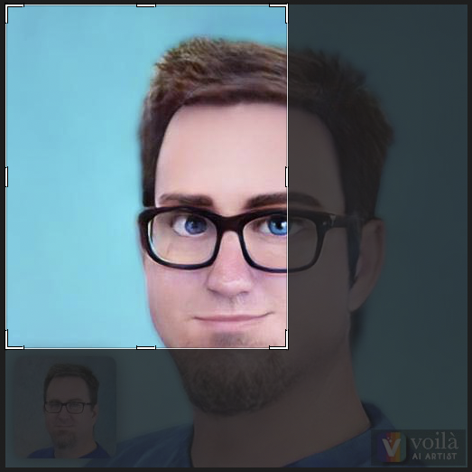

# Images

The **images** package provides methods for working with images.

## ImageCropper

ImageCropper is a service designed to crop images. There are a couple of ways to perform a crop. The first is a traditional crop starting from the top left corner with a width and height (pixels or ratio). The second is a crop originating from the center, going out a number of pixels or ratio.




Here is an example of cropping from the top left.

```go
package main

import (
	"bytes"
	"image"
	"io/ioutil"
	"os"

	"github.com/app-nerds/kit/v6/images"
)

func main() {
	var (
		err          error
		imageBytes   []byte
		croppedBytes *bytes.Buffer
		newFile      *os.File
	)

	/*
	 * Open the original image
	 */
	if imageBytes, err = ioutil.ReadFile("./yolie.jpeg"); err != nil {
		panic(err)
	}

	cropper := images.ImageCropper{}

	croppedBytes, err = cropper.Crop(imageBytes, images.CropOptions{
		Anchor:     image.Point{X: 10, Y: 10},
		AnchorMode: images.CropAnchorModeTopLeft,
		Height:     100,
		UseRatio:   false,
		Width:      100,
	})

	if err != nil {
		panic(err)
	}

	if newFile, err = os.Create("./new-image.jpg"); err != nil {
		panic(err)
	}

	if _, err = croppedBytes.WriteTo(newFile); err != nil {
		panic(err)
	}

	newFile.Close()
}
```

Now here is an example of a center crop with a 1:1 ratio (square).

```go
package main

import (
	"bytes"
	"io/ioutil"
	"os"

	"github.com/app-nerds/kit/v6/images"
)

func main() {
	var (
		err          error
		imageBytes   []byte
		croppedBytes *bytes.Buffer
		newFile      *os.File
	)

	/*
	 * Open the original image
	 */
	if imageBytes, err = ioutil.ReadFile("./image.jpeg"); err != nil {
		panic(err)
	}

	cropper := images.ImageCropper{}

	croppedBytes, err = cropper.Crop(imageBytes, images.CropOptions{
		AnchorMode: images.CropAnchorModeCentered,
		Height:     3,
		UseRatio:   true,
		Width:      4,
	})

	if err != nil {
		panic(err)
	}

	if newFile, err = os.Create("./new-image.png"); err != nil {
		panic(err)
	}

	if _, err = croppedBytes.WriteTo(newFile); err != nil {
		panic(err)
	}

	newFile.Close()
}
```

## Resizer

The resizer service provides methods for resizing images.

### ResizeImage

ResizeImage takes a source image, and a predefined image size, then returns the proportionally resized image. Sizes are:

* Thumbnail - Resizes the image to a 10th of its original size
* Small - Resizes the image to 25% of its original size
* Medium - Resizes the image to 50% of its original size
* Large - Original size

Below is an example of opening an image file and resizing it, saving it as a new file.

```go
package main

import (
	"bytes"
	"os"

	"github.com/app-nerds/kit/v6/images"
)

func main() {
	var (
		err          error
		originalFile *os.File
		newFile      *os.File
		resizedBytes *bytes.Buffer
	)

	/*
	 * Open the original image
	 */
	if originalFile, err = os.Open("./image.jpeg"); err != nil {
		panic(err)
	}

	defer originalFile.Close()

	resizer := images.Resizer{}

	if resizedBytes, err = resizer.ResizeImage(originalFile, "image/jpeg", images.MEDIUM); err != nil {
		panic(err)
	}

	if newFile, err = os.Create("./new-image.jpg"); err != nil {
		panic(err)
	}

	if _, err = resizedBytes.WriteTo(newFile); err != nil {
		panic(err)
	}

	newFile.Close()
}
```

### ResizeImagePixels

ResizeImagePixels is similar to **ResizeImage**, except it deals with a specific width and height setting instead of relative sizing. Note that this method does not concern itself with preserving aspect ratio.

```go
package main

import (
	"bytes"
	"os"

	"github.com/app-nerds/kit/v6/images"
)

func main() {
	var (
		err          error
		originalFile *os.File
		newFile      *os.File
		resizedBytes *bytes.Buffer
	)

	/*
	 * Open the original image
	 */
	if originalFile, err = os.Open("./image.jpeg"); err != nil {
		panic(err)
	}

	defer originalFile.Close()

	resizer := images.Resizer{}

	if resizedBytes, err = resizer.ResizeImagePixels(originalFile, "image/jpeg", 200, 200); err != nil {
		panic(err)
	}

	if newFile, err = os.Create("./new-image.jpg"); err != nil {
		panic(err)
	}

	if _, err = resizedBytes.WriteTo(newFile); err != nil {
		panic(err)
	}

	newFile.Close()
}
```
